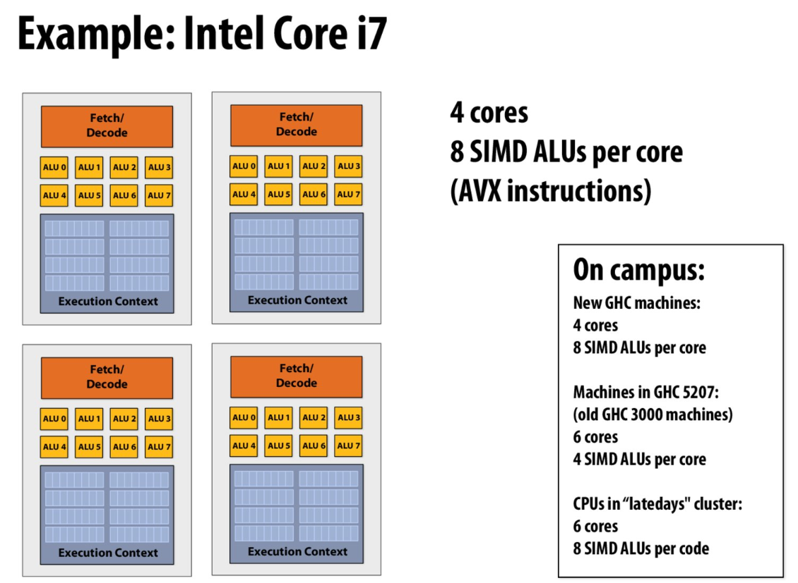
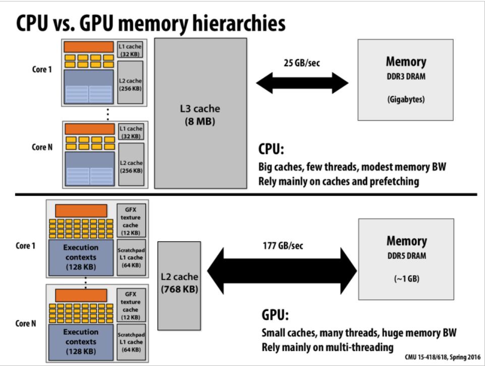

# A Modern Multi-Core Processor
* Purpose: Know SIMD,Cache,CPU&GPU
* Attention: assume each instrcution is **independent**!  
So we won't discuss communication here.

## Sigle Instruction Multiple Data(SIMD)
* 单指令流-> 运行在一个指令流中，无通信，无开销，没有达到负载平衡
* 由指令执行的上下文是一致的，且当指令之间相互独立的时候，则可以通过不同的线程来执行，同时也可以采取增加解码单元和执行单元的个数来执行。
* SIMD -> 一次操作n件事，eg:8个ALU可以同时做一件事情

# Accessing Memory
* 如何减少停顿期？
* cache技术
* cpu:有更大容量的cache所以保证更快命中，gpu:更多线程，能够更好用在图形计算上
