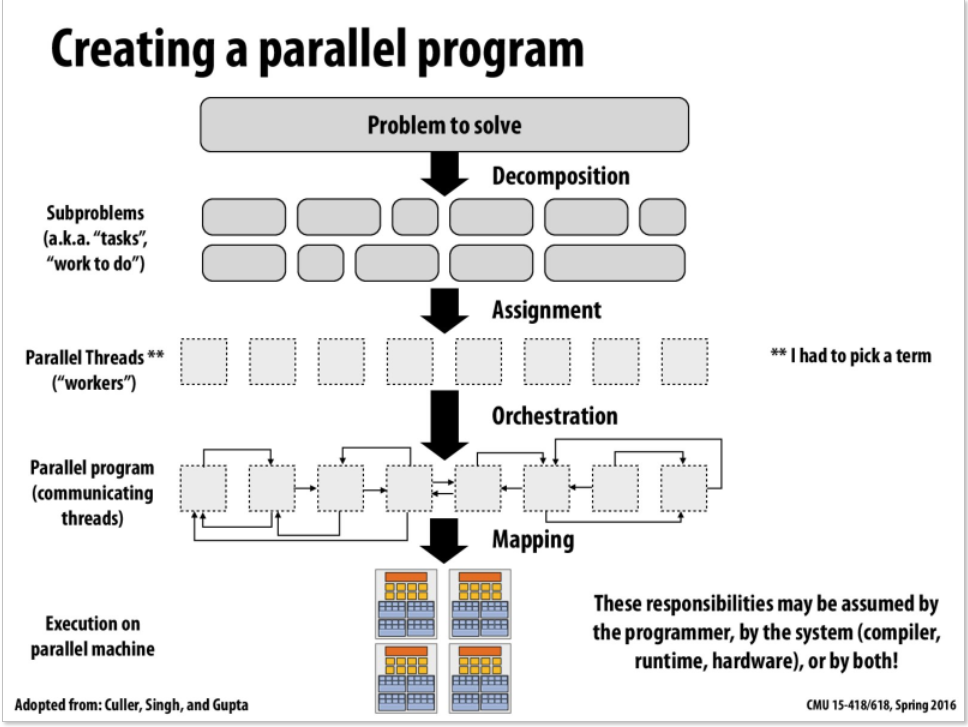
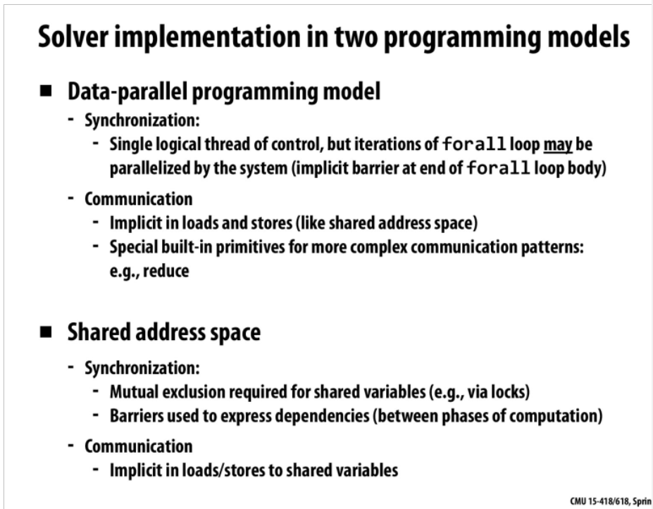

# Parallel Programming Basics
```
review:
data-parallel model:
collect data for a set,and compute them in different alu
computer map the ispc into the N's set
stream:elements can be processed independently,and 把这些流都映射到kernel上，利用多处理器来处理。

parallel programming's main purpose: speedup


1. 将一个事分为多个去做，每一个task都得使得一个机器忙碌，分为子问题，且子问题要独立。
amdahl's law


decomposing computation or data
```
## Creating a parallel program
* what we care is how to impove **speedup**
* how to creat a parallel program:

* From the picture above, we can draw a conclusion that: the main idea is to create at least enough tasks to keep all execution units on machine busy, so we must know how to **devide** each task
* **amdahl's law**: dependencies limit maximum speedup due to parallelism.
### 流程
* subproblems: 将每个问题都划分为多个子问题
* parallel thread: 建立线程
* remember: 当将一个任务分为多个子问题之后，子问题最后得到的答案连接起来也是要耗时间的。
* orchestration: 建立线程之间的通信，保持子问题的独立性，组织内存空间的使用，对任务进行排序，目的在于减少通信之间的时间消耗
* mapping to hardware: map cuda thraed blocks to gpu cores
## two programming models
* data-parallel programming model
* shared address space
